# Wiki Documentation for https://github.com/jazzwang/hpt-chat

Generated on: 2025-10-29 15:34:21 using https://github.com/AsyncFuncAI/deepwiki-open

## Table of Contents

- [Project Introduction](#page-intro)
- [Overall System Architecture](#page-overall-architecture)
- [LangChain Agent Workflow](#page-agent-workflow)
- [Chatbot Core Functionality](#page-chatbot-features)
- [](#page-data-mrf)

<a id='page-intro'></a>

## Project Introduction

### Related Pages

Related topics: [Overall System Architecture](#page-overall-architecture), [Chatbot Core Functionality](#page-chatbot-features)

<details>
<summary>Relevant source files</summary>

The following files were used as context for generating this wiki page:

- [LangChain-OpenAI/README.md](https://github.com/jazzwang/hpt-chat/blob/main/LangChain-OpenAI/README.md)
- [LangChain-OpenAI/chainlit.md](https://github.com/jazzwang/hpt-chat/blob/main/LangChain-OpenAI/chainlit.md)
- [LangChain-OpenAI/hpt-chat.py](https://github.com/jazzwang/hpt-chat/blob/main/LangChain-OpenAI/hpt-chat.py)
- [LangChain-OpenAI/lanarky_test.py](https://github.com/jazzwang/hpt-chat/blob/main/LangChain-OpenAI/lanarky_test.py)
- [LangChain-OpenAI/templates/index.html](https://github.com/jazzwang/hpt-chat/blob/main/LangChain-OpenAI/templates/index.html)
</details>

# Project Introduction

This project, named `hpt-chat`, is a Proof-of-Concept (POC) chatbot application designed to interact with Machine Readable File (MRF) data from Bacon Country Hospital. Its primary purpose is to allow users to query hospital pricing and procedure information using natural language, which is then translated into SQL queries to a SQLite database. The project leverages the LangChain framework for building conversational agents and integrates with OpenAI's language models.

The application offers multiple interfaces, including a Chainlit-based chatbot UI, a FastAPI/Lanarky web interface with a WebSocket connection, and a command-line interface for direct database queries. The core functionality revolves around an AI agent capable of understanding user questions, performing calculations, and querying a structured database to provide relevant answers regarding medical procedures and their associated costs.

## Core Architecture

The `hpt-chat` project is built around the LangChain framework, utilizing a `ZERO_SHOT_REACT_DESCRIPTION` agent to process user input. This agent orchestrates the use of various tools to fulfill user requests, including a calculator for mathematical operations and a database chain for SQL queries. The system uses `ChatOpenAI` as the underlying Large Language Model (LLM) for natural language understanding and generation.

The agent's decision-making process involves:
1.  Receiving a user question.
2.  Determining the appropriate tool (e.g., "Calculator" or "Price") based on the question's intent.
3.  Executing the tool.
4.  Formulating a response to the user.
Conversation memory is maintained using `ConversationBufferMemory` to enable multi-turn interactions.

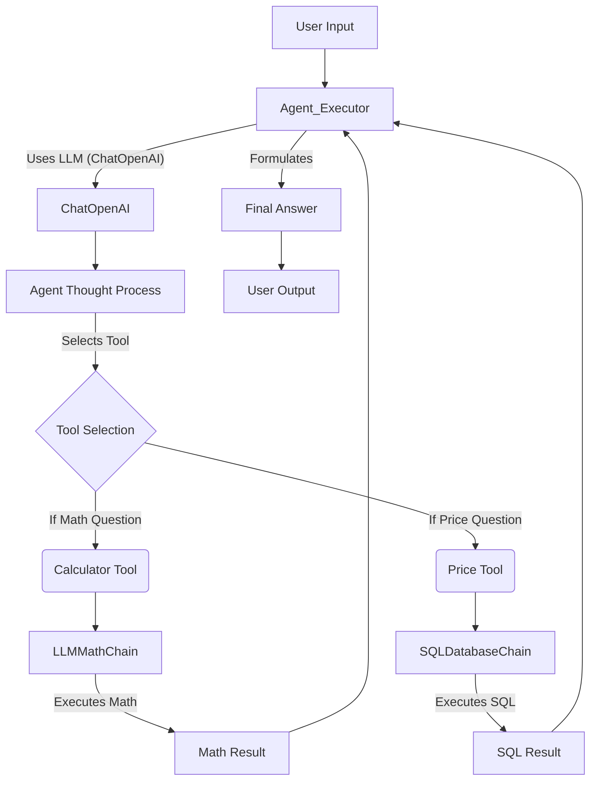
*Architecture Flow of the LangChain Agent. Sources: [hpt-chat.py:20-45](), [lanarky_test.py:32-62]()*

### Agent Tools

The agent is equipped with specific tools to handle different types of queries:

| Tool Name  | Function                    | Description                                       | Source File           |
| :--------- | :-------------------------- | :------------------------------------------------ | :-------------------- |
| Calculator | `llm_math_chain.run`        | Useful for answering questions about math.        | [hpt-chat.py:30-32](), [lanarky_test.py:44-46]() |
| Price      | `db_chain.run`              | Useful for answering questions about price.       | [hpt-chat.py:33-36](), [lanarky_test.py:47-50]() |
| Chat       | `chat.run` (Lanarky only)   | Useful for general questions not related to math or price. | [lanarky_test.py:40-43]() |

The `Chat` tool is specifically implemented in the `lanarky_test.py` version of the agent, utilizing a `ConversationChain` for general conversational queries. Sources: [lanarky_test.py:36-37](), [lanarky_test.py:40-43]()

## Data Source and Schema

The primary data source for the application is a SQLite database named `sample.db`. This database contains a single table named `MRF`, which stores the Machine Readable File (MRF) data from Bacon Country Hospital. The data includes various details about medical procedures, pricing, and payer information.

The `MRF` table is created with the following schema:

```sql
CREATE TABLE IF NOT EXISTS "MRF"(
  "PRIMARY_PROCEDURE_DESCRIPTION" TEXT,
  "SETTING_TYPE" TEXT,
  "SERVICE_COMPONENT_BREAKOUT_TYPE" TEXT,
  "SERVICE_COMPONENT_BREAKOUT_NAME" TEXT,
  "DRG_CODE" TEXT,
  "CPT_CODE" TEXT,
  "MODIFIER" TEXT,
  "HCPCS_CODE" TEXT,
  "REV_CODE" TEXT,
  "GROSS_PRICE" TEXT,
  "CASH_PRICE" TEXT,
  "NEGOTIATED_PRICE" TEXT,
  "DEIDENTIFIED_MIN_PRICE" TEXT,
  "DEIDENTIFIED_MAX_PRICE" TEXT,
  "PAYER_NAME" TEXT,
  "NETWORK_NAME" TEXT
);
```
*MRF Table Schema. Sources: [LangChain-OpenAI/README.md:37-53]()*

The data for this database is typically loaded from a CSV file (e.g., `ein_BaconCountyHospital_standardcharges.csv.zip`) which is downloaded and extracted during the setup process. Sources: [LangChain-OpenAI/README.md:21-36]()

## Deployment and User Interfaces

The `hpt-chat` project supports multiple ways for users to interact with the chatbot, catering to different deployment scenarios and user preferences.

### Chainlit Interface

The `hpt-chat.py` script provides a chatbot interface powered by Chainlit, a Python library for building conversational AI applications. This interface offers a rich, asynchronous chat experience directly within a web browser. The agent is initialized using the `@cl.langchain_factory` decorator, making it accessible through the Chainlit UI.

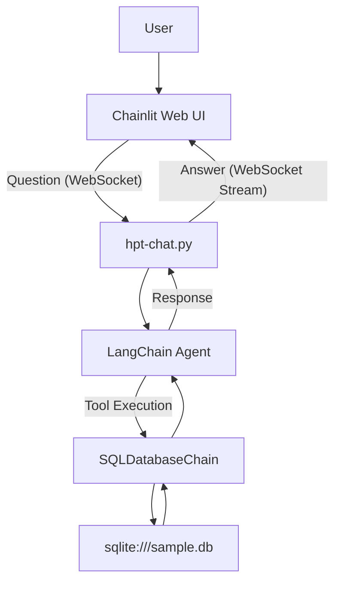
*Interaction Flow with Chainlit UI. Sources: [hpt-chat.py:17-45]()*

### Lanarky/FastAPI Interface

An alternative web interface is provided through `lanarky_test.py`, which integrates LangChain with FastAPI and Lanarky. This setup offers RESTful API endpoints and WebSocket connectivity, allowing for flexible frontend integration. The frontend for this interface is an HTML page (`index.html`) that communicates with the backend via WebSockets.

The `index.html` template defines the chat layout and JavaScript logic to send user messages and display bot responses. It handles different message types (`start`, `stream`, `info`, `end`, `error`) to update the UI dynamically. Sources: [LangChain-OpenAI/templates/index.html:105-132]()

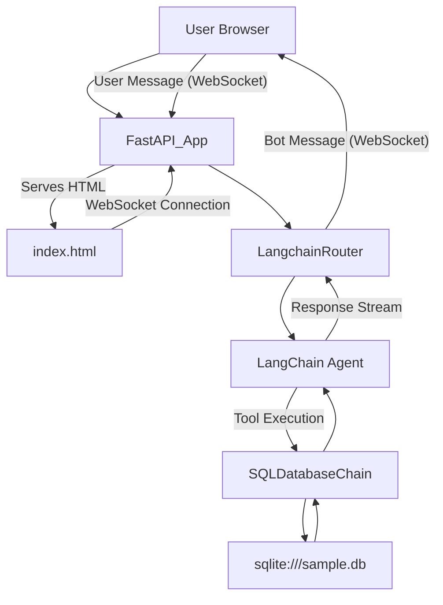
*Interaction Flow with Lanarky/FastAPI and WebSocket UI. Sources: [lanarky_test.py:73-86](), [LangChain-OpenAI/templates/index.html:105-132]()*

### Command Line Interface (CLI)

For direct interaction with the SQL database chain without a full chat interface, the `bacon.py` script offers a command-line interface. It takes a user question as a command-line argument and directly runs it through an `SQLDatabaseChain` to query `sqlite:///sample.db`. This is useful for quick, single-turn queries or scripting.

```bash
./bacon.py "YOUR QUESTION"
```
*CLI Usage Example. Sources: [LangChain-OpenAI/README.md:16-17](), [LangChain-OpenAI/bacon.py:16-17]()*

## Key Components and Dependencies

The project relies on several key Python packages, primarily from the LangChain ecosystem, to build its conversational AI capabilities.

| Package       | Description                                                 | Source File             |
| :------------ | :---------------------------------------------------------- | :---------------------- |
| `langchain`   | Core framework for developing applications with LLMs.       | [requirements.txt:1]()  |
| `openai`      | Python client for OpenAI API, used for `ChatOpenAI` and `OpenAI` models. | [requirements.txt:2]() |
| `python-dotenv` | Loads environment variables from a `.env` file.           | [requirements.txt:3]() |
| `chainlit`    | Framework for building and deploying LLM applications.      | [requirements.txt:4]() |
| `sqlalchemy`  | SQL toolkit and Object Relational Mapper (ORM), used by `SQLDatabase`. | [LangChain-OpenAI/README.md:68]() |
| `fastapi`     | Web framework for building APIs.                            | [lanarky_test.py:3]() |
| `lanarky`     | Integrates LangChain with FastAPI for streaming and websockets. | [lanarky_test.py:16]() |

## Example Interactions

The project is designed to answer a variety of questions related to hospital pricing data. Here are some examples of supported queries and their expected outcomes:

*   **Count of distinct CPT codes:**
    ```bash
    gitpod /workspace/gitpod-labs/shop-chat-poc (master) $ ./bacon.py "count of distinct cpt"
    # Expected SQLQuery: SELECT COUNT(DISTINCT "CPT_CODE") FROM "MRF"
    # Expected Answer: There are 1229 distinct CPT codes.
    ```
    Sources: [LangChain-OpenAI/README.md:89-93]()

*   **Price of IRON related procedures (fuzzy search):**
    ```bash
    gitpod /workspace/gitpod-labs/shop-chat-poc (master) $ ./bacon.py "price of IRON related precedures"
    # Expected SQLQuery: SELECT "PRIMARY_PROCEDURE_DESCRIPTION", "GROSS_PRICE", "CASH_PRICE", "NEGOTIATED_PRICE" FROM "MRF" WHERE "PRIMARY_PROCEDURE_DESCRIPTION" LIKE '%IRON%' LIMIT 5;
    # Expected Answer: The price of IRON related procedures ranges from 21.28 to 60.42.
    ```
    Sources: [LangChain-OpenAI/README.md:104-108](), [LangChain-OpenAI/chainlit.md:25-27]()

*   **Listing database columns:**
    ```bash
    gitpod /workspace/gitpod-labs/shop-chat-poc (master) $ ./bacon.py "list columns of database"
    # Expected SQLQuery: SELECT * FROM MRF LIMIT 5;
    # Expected Answer: The columns of the database are PRIMARY_PROCEDURE_DESCRIPTION, SETTING_TYPE, SERVICE_COMPONENT_BREAKOUT_TYPE, SERVICE_COMPONENT_BREAKOUT_NAME, DRG_CODE, CPT_CODE, MODIFIER, HCPCS_CODE, REV_CODE, GROSS_PRICE, CASH_PRICE, NEGOTIATED_PRICE, DEIDENTIFIED_MIN_PRICE, DEIDENTIFIED_MAX_PRICE, PAYER_NAME, and NETWORK_NAME.
    ```
    Sources: [LangChain-OpenAI/README.md:113-117]()

The chatbot also supports questions in multiple languages (Spanish, Japanese, Chinese) by translating the natural language query into an appropriate SQL statement. Sources: [LangChain-OpenAI/chainlit.md:9-21]()

## Conclusion

The `hpt-chat` project provides a robust and flexible solution for querying complex healthcare pricing data using natural language. By integrating LangChain, OpenAI LLMs, and SQL database interactions, it demonstrates how AI agents can be built to provide intuitive access to structured information. The multiple user interfaces ensure accessibility for various use cases, from interactive chat to direct command-line queries, showcasing the project's versatility and potential for broader applications in data exploration.

---

<a id='page-overall-architecture'></a>

## Overall System Architecture

### Related Pages

Related topics: [Project Introduction](#page-intro), [LangChain Agent Workflow](#page-agent-workflow)

<details>
<summary>Relevant source files</summary>

- [LangChain-OpenAI/hpt-chat.py](https://github.com/jazzwang/hpt-chat/blob/main/LangChain-OpenAI/hpt-chat.py)
- [LangChain-OpenAI/lanarky_test.py](https://github.com/jazzwang/hpt-chat/blob/main/LangChain-OpenAI/lanarky_test.py)
- [LangChain-OpenAI/README.md](https://github.com/jazzwang/hpt-chat/blob/main/LangChain-OpenAI/README.md)
- [LangChain-OpenAI/templates/index.html](https://github.com/jazzwang/hpt-chat/blob/main/LangChain-OpenAI/templates/index.html)
- [LangChain-OpenAI/bacon.py](https://github.com/jazzwang/hpt-chat/blob/main/LangChain-OpenAI/bacon.py)
- [LangChain-OpenAI/requirements.txt](https://github.com/jazzwang/hpt-chat/blob/main/LangChain-OpenAI/requirements.txt)
- [LangChain-OpenAI/gen-faiss-index-from-mrf.py](https://github.com/jazzwang/hpt-chat/blob/main/LangChain-OpenAI/gen-faiss-index-from-mrf.py)
</details>

# Overall System Architecture

The `hpt-chat` project implements a chatbot application designed to answer questions, particularly those related to medical pricing data from Machine Readable Files (MRF). The system leverages LangChain for orchestrating Large Language Models (LLMs) and various tools, providing natural language querying capabilities over structured data. It supports multiple deployment and interaction methods, including a Chainlit-based UI for interactive chat and a FastAPI/Lanarky backend with a custom HTML/JavaScript frontend for streaming responses. The core functionality revolves around intelligent agents that select and utilize specialized tools for mathematical calculations and database queries. Sources: [LangChain-OpenAI/README.md](), [LangChain-OpenAI/hpt-chat.py](), [LangChain-OpenAI/lanarky_test.py]()

## Core Components

The system's intelligence and data interaction capabilities are built upon several key LangChain components, including an LLM, a SQL database, and a set of specialized tools, all orchestrated by an agent.

### Large Language Model (LLM)

The primary computational engine is an LLM, specifically `ChatOpenAI`. It is configured for a low temperature to ensure deterministic and factual responses, and streaming is enabled for real-time output in the user interfaces. Sources: [LangChain-OpenAI/hpt-chat.py:17-19](), [LangChain-OpenAI/lanarky_test.py:53-55]()

```python
# LangChain-OpenAI/hpt-chat.py
llm = ChatOpenAI(
    temperature=0,
    streaming=True,
)
```
Sources: [LangChain-OpenAI/hpt-chat.py:17-19]()

### Database Interaction

The system interacts with a SQLite database named `sample.db` which is populated from an MRF CSV file. This database contains detailed medical pricing information. LangChain's `SQLDatabase` and `SQLDatabaseChain` are used to enable natural language queries to be translated into SQL queries and executed against this database. Sources: [LangChain-OpenAI/hpt-chat.py:22-23](), [LangChain-OpenAI/lanarky_test.py:61-62](), [LangChain-OpenAI/bacon.py:12-13]()

The `MRF` table schema is as follows:

| Column Name                     | Type | Description                                        |
| :------------------------------ | :--- | :------------------------------------------------- |
| PRIMARY_PROCEDURE_DESCRIPTION   | TEXT | Description of the primary medical procedure       |
| SETTING_TYPE                    | TEXT | Type of setting where service is provided          |
| SERVICE_COMPONENT_BREAKOUT_TYPE | TEXT | Breakout type for service components               |
| SERVICE_COMPONENT_BREAKOUT_NAME | TEXT | Name of the service component breakout             |
| DRG_CODE                        | TEXT | Diagnosis Related Group code                       |
| CPT_CODE                        | TEXT | Current Procedural Terminology code                |
| MODIFIER                        | TEXT | CPT modifier                                       |
| HCPCS_CODE                      | TEXT | Healthcare Common Procedure Coding System code     |
| REV_CODE                        | TEXT | Revenue code                                       |
| GROSS_PRICE                     | TEXT | Gross price of the procedure                       |
| CASH_PRICE                      | TEXT | Cash price of the procedure                        |
| NEGOTIATED_PRICE                | TEXT | Negotiated price of the procedure                  |
| DEIDENTIFIED_MIN_PRICE          | TEXT | Deidentified minimum price                         |
| DEIDENTIFIED_MAX_PRICE          | TEXT | Deidentified maximum price                         |
| PAYER_NAME                      | TEXT | Name of the payer (insurance company)              |
| NETWORK_NAME                    | TEXT | Name of the network                                |

Sources: [LangChain-OpenAI/README.md:32-47]()

### Tools

The agent utilizes specific tools to perform different types of tasks:

*   **Calculator**: An `LLMMathChain` instance, useful for mathematical questions. Sources: [LangChain-OpenAI/hpt-chat.py:25-27](), [LangChain-OpenAI/lanarky_test.py:56-58]()
*   **Price**: An `SQLDatabaseChain` instance, designed to answer questions related to pricing by querying the `sample.db`. Sources: [LangChain-OpenAI/hpt-chat.py:28-31](), [LangChain-OpenAI/lanarky_test.py:59-62]()
*   **Chat** (only in `lanarky_test.py`): A `ConversationChain` for handling general conversational queries not related to math or pricing. Sources: [LangChain-OpenAI/lanarky_test.py:64-66]()

The relationship between the agent and its tools is depicted below:

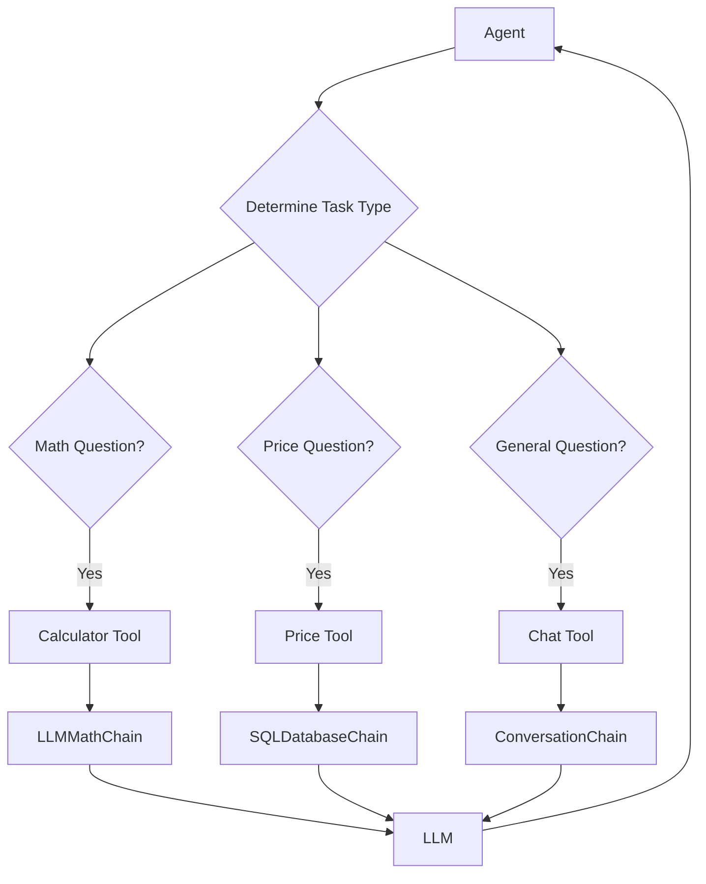
Sources: [LangChain-OpenAI/hpt-chat.py:25-31](), [LangChain-OpenAI/lanarky_test.py:56-66]()

### Agent Orchestration

A `ZERO_SHOT_REACT_DESCRIPTION` agent is initialized to select the appropriate tool based on the user's input. The agent uses `ConversationBufferMemory` to maintain conversational context across turns, allowing for multi-turn interactions. Sources: [LangChain-OpenAI/hpt-chat.py:38-46](), [LangChain-OpenAI/lanarky_test.py:76-83]()

```python
# LangChain-OpenAI/hpt-chat.py
agent_kwargs = {
    "extra_prompt_messages": [MessagesPlaceholder(variable_name="memory")],
}
memory = ConversationBufferMemory(memory_key="memory", return_messages=True)
return initialize_agent(
    tools,
    llm,
    agent=AgentType.ZERO_SHOT_REACT_DESCRIPTION,
    verbose=True,
    agent_kwargs=agent_kwargs,
    memory=memory
)
```
Sources: [LangChain-OpenAI/hpt-chat.py:38-46]()

## User Interface and API Layers

The project provides two distinct user interfaces: one based on Chainlit and another using FastAPI with a custom HTML frontend.

### Chainlit Integration

The `hpt-chat.py` file serves as the entry point for the Chainlit application. It uses the `@cl.langchain_factory` decorator to integrate the LangChain agent with the Chainlit UI, enabling an interactive chat experience. The `use_async=False` parameter indicates synchronous processing for the LangChain components. Sources: [LangChain-OpenAI/hpt-chat.py:14](), [LangChain-OpenAI/hpt-chat.py:48-49]()

The Chainlit application workflow is as follows:

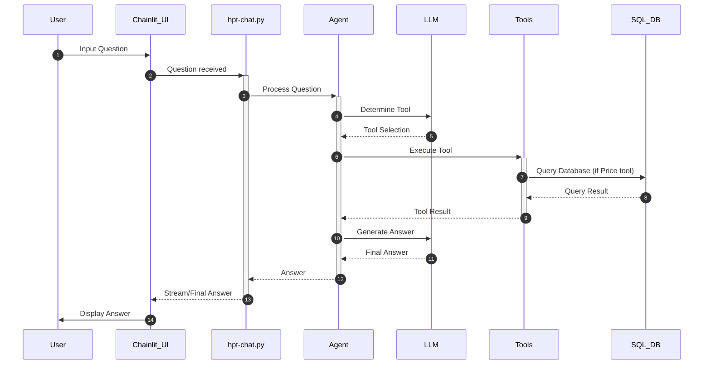
Sources: [LangChain-OpenAI/hpt-chat.py]()

### FastAPI and Lanarky Integration

The `lanarky_test.py` file sets up a FastAPI application that integrates LangChain via the Lanarky library. This provides RESTful API endpoints and WebSocket communication for the chatbot. A `LangchainRouter` is used to expose `/chat`, `/chat_json`, and `/ws` endpoints, with `/ws` specifically handling streaming responses over WebSockets. Sources: [LangChain-OpenAI/lanarky_test.py:30-45](), [LangChain-OpenAI/lanarky_test.py:85-91]()

The API endpoints provided by the `LangchainRouter` are:

| Endpoint      | Method | Description                                    | Streaming Mode |
| :------------ | :----- | :--------------------------------------------- | :------------- |
| `/chat`       | POST   | Standard chat endpoint                         | 1              |
| `/chat_json`  | POST   | Chat endpoint returning JSON responses         | 2              |
| `/ws`         | WebSocket | WebSocket endpoint for streaming chat responses | N/A            |

Sources: [LangChain-OpenAI/lanarky_test.py:40-45]()

The WebSocket-based communication flow for the FastAPI/Lanarky application is detailed below:

```mermaid
sequenceDiagram
    participant User
    participant Browser_UI as index.html
    participant FastAPI_App as lanarky_test.py
    participant LangchainRouter
    participant Agent
    participant LLM
    participant Tools
    participant SQL_DB

    autonumber
    User->>Browser_UI: Input Question
    Browser_UI->FastAPI_App: WebSocket message
    FastAPI_App->LangchainRouter: Route to Chain
    LangchainRouter->Agent: Process Question
    Agent->>LLM: Determine Tool
    LLM-->>Agent: Tool Selection
    Agent->>+Tools: Execute Tool
    Tools->>SQL_DB: Query Database (if Price tool)
    SQL_DB-->>Tools: Query Result
    Tools-->>-Agent: Tool Result
    Agent->>LLM: Generate Answer
    LLM-->>Agent: Final Answer
    Agent-->>-LangchainRouter: Answer Stream
    LangchainRouter-->>-FastAPI_App: Stream data
    FastAPI_App-->>-Browser_UI: WebSocket stream (bot:stream)
    Browser_UI->>User: Display streamed text
    FastAPI_App-->>-Browser_UI: WebSocket end (bot:end)
    Browser_UI->>User: Final Answer displayed
```

Sources: [LangChain-OpenAI/lanarky_test.py](), [LangChain-OpenAI/templates/index.html]()

### Frontend UI (`index.html`)

A simple HTML/JavaScript frontend (`templates/index.html`) is provided for the FastAPI/Lanarky application. It uses WebSockets to send user messages and receive streaming responses from the backend. The UI dynamically updates the chat interface based on different message types (`start`, `stream`, `info`, `end`, `error`) received from the chatbot. Sources: [LangChain-OpenAI/templates/index.html]()

```javascript
// LangChain-OpenAI/templates/index.html
ws.onmessage = function (event) {
    var messages = document.getElementById("messages");
    var data = JSON.parse(event.data);
    if (data.sender === "bot") {
      if (data.message_type === "start") {
        var header = document.getElementById("header");
        header.innerHTML = "Computing answer...";
        var div = document.createElement("div");
        div.className = "server-message";
        var p = document.createElement("p");
        p.innerHTML = "<strong>" + "Chatbot: " + "</strong>";
        div.appendChild(p);
        messages.appendChild(div);
      } else if (data.message_type === "stream") {
        var header = document.getElementById("header");
        header.innerHTML = "Chatbot is typing...";
        var p = messages.lastChild.lastChild;
        if (data.message === "\n") {
          p.innerHTML += "<br>";
        } else {
          p.innerHTML += data.message;
        }
      } else if (data.message_type === "info") {
        var header = document.getElementById("header");
        header.innerHTML = data.message;
      } else if (data.message_type === "end") {
        var header = document.getElementById("header");
        header.innerHTML = "Ask a question";
        var button = document.getElementById("send");
        button.innerHTML = "Send";
        button.disabled = false;
      } else if (data.message_type === "error") {
        var header = document.getElementById("header");
        header.innerHTML = "Ask a question";
        var button = document.getElementById("send");
        button.innerHTML = "Send";
        button.disabled = false;
        var p = messages.lastChild.lastChild;
        p.innerHTML += data.message;
      }
    } else {
      var div = document.createElement("div");
      div.className = "client-message";
      var p = document.createElement("p");
      p.innerHTML = "<strong>" + "You: " + "</strong>";
      p.innerHTML += data.message;
      div.appendChild(p);
      messages.appendChild(div);
    }
    messages.scrollTop = messages.scrollHeight;
};
```
Sources: [LangChain-OpenAI/templates/index.html:121-177]()

## Data Flow and Processing

### Data Ingestion

The system processes medical pricing data from a Machine Readable File (MRF) in CSV format. This involves downloading a zipped CSV file, extracting it, and then populating a SQLite database. Additionally, a separate script demonstrates generating a FAISS vector index from CSV data, although its direct integration into the live chatbot agents (`hpt-chat.py`, `lanarky_test.py`) is not explicitly shown in the provided context. Sources: [LangChain-OpenAI/README.md:21-47](), [LangChain-OpenAI/gen-faiss-index-from-mrf.py:9-18]()

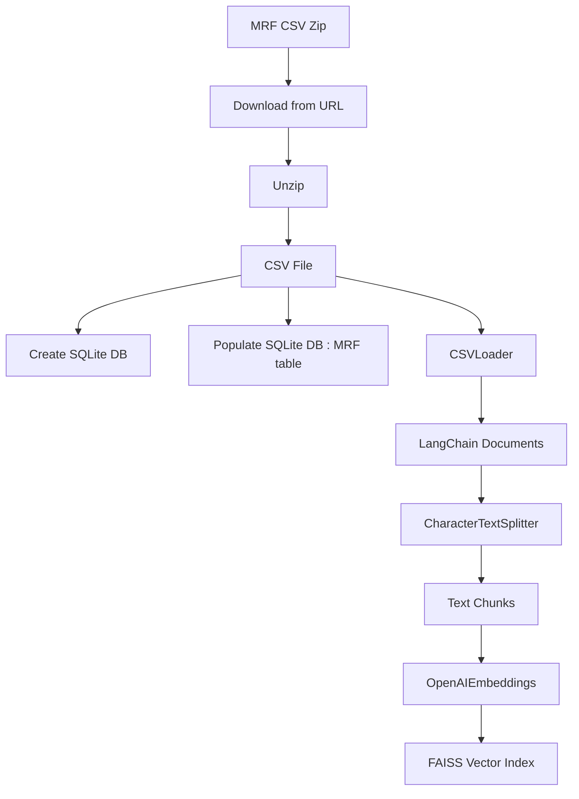
Sources: [LangChain-OpenAI/README.md:21-47](), [LangChain-OpenAI/gen-faiss-index-from-mrf.py:9-18]()

### Query Processing

When a user submits a question, it is routed to the LangChain agent. The agent, using its internal reasoning capabilities (ReAct pattern), determines which tool is most suitable for answering the query. It then invokes the selected tool (e.g., `SQLDatabaseChain` for price questions, `LLMMathChain` for math questions). The tool executes its function, potentially interacting with the database or performing calculations. The result from the tool is then fed back to the LLM, which formulates a natural language answer that is finally presented to the user. Sources: [LangChain-OpenAI/hpt-chat.py](), [LangChain-OpenAI/lanarky_test.py]()

## Conclusion

The `hpt-chat` project presents a robust, agent-based chatbot architecture built on LangChain and OpenAI. It effectively translates natural language queries into structured data interactions, primarily with a SQLite database containing medical pricing information. The system's modular design, utilizing specialized tools and conversational memory, allows for versatile question-answering capabilities. With support for both Chainlit and FastAPI/WebSocket interfaces, it offers flexible deployment options for interactive user experiences.

---

<a id='page-agent-workflow'></a>

## LangChain Agent Workflow

### Related Pages

Related topics: [Overall System Architecture](#page-overall-architecture), [Chatbot Core Functionality](#page-chatbot-features)

<details>
<summary>Relevant source files</summary>

- [LangChain-OpenAI/hpt-chat.py](https://github.com/jazzwang/hpt-chat/blob/main/LangChain-OpenAI/hpt-chat.py)
- [LangChain-OpenAI/lanarky_test.py](https://github.com/jazzwang/hpt-chat/blob/main/LangChain-OpenAI/lanarky_test.py)
- [LangChain-OpenAI/README.md](https://github.com/jazzwang/hpt-chat/blob/main/LangChain-OpenAI/README.md)
- [LangChain-OpenAI/bacon.py](https://github.com/jazzwang/hpt-chat/blob/main/LangChain-OpenAI/bacon.py)
- [LangChain-OpenAI/requirements.txt](https://github.com/jazzwang/hpt-chat/blob/main/LangChain-OpenAI/requirements.txt)
</details>

# LangChain Agent Workflow

The LangChain Agent Workflow in this project establishes a conversational AI system capable of responding to user queries by dynamically selecting and utilizing specialized tools. It integrates a Large Language Model (LLM) with specific functionalities like mathematical calculations and database interactions, all while maintaining conversational memory. The system is designed for flexible deployment, demonstrated through both Chainlit for a chatbot UI and Lanarky (FastAPI with Gradio) for web-based interaction. Sources: [LangChain-OpenAI/hpt-chat.py](), [LangChain-OpenAI/lanarky_test.py](), [LangChain-OpenAI/README.md]()

This workflow enables the agent to parse natural language questions, determine the appropriate action (e.g., query a database for prices, perform a calculation, or engage in general conversation), and execute that action using predefined tools. The agent's ability to reason and act is powered by the `ZERO_SHOT_REACT_DESCRIPTION` agent type, allowing it to decide based on tool descriptions. Sources: [LangChain-OpenAI/hpt-chat.py:36-42](), [LangChain-OpenAI/lanarky_test.py:71-77]()

## Core Components of the Agent Workflow

The LangChain agent workflow is built upon several foundational components that work in concert to process user input and generate responses.

### Language Model (LLM)

The system primarily utilizes `ChatOpenAI` as the underlying Language Model. It is configured with `temperature=0` for deterministic responses and `streaming=True` to enable real-time output in conversational interfaces. Sources: [LangChain-OpenAI/hpt-chat.py:16-19](), [LangChain-OpenAI/lanarky_test.py:46-49]()

### Tools

Tools are specialized functions that the agent can invoke to perform specific tasks. The agent selects a tool based on the user's query and the tool's `description`.

| Tool Name  | Description                                                               | Underlying Chain / Function  | Source File                |
| :--------- | :------------------------------------------------------------------------ | :--------------------------- | :------------------------- |
| `Calculator` | Useful for when you need to answer questions about math                   | `LLMMathChain`               | [hpt-chat.py:27-28](), [lanarky_test.py:61-62]() |
| `Price`    | Useful for when you need to answer questions about price                  | `SQLDatabaseChain`           | [hpt-chat.py:30-31](), [lanarky_test.py:64-65]() |
| `Chat`     | Useful for when you need to answer questions not related to math or price | `ConversationChain`          | [lanarky_test.py:58-59]() |

Sources: [LangChain-OpenAI/hpt-chat.py:20-31](), [LangChain-OpenAI/lanarky_test.py:50-66]()

### SQL Database Integration

The `Price` tool integrates with a SQLite database named `sample.db` using `SQLDatabase.from_uri("sqlite:///sample.db")`. This database contains a table named `MRF` (Machine Readable File) which stores healthcare pricing information. The `SQLDatabaseChain` is used to interact with this database. Sources: [LangChain-OpenAI/hpt-chat.py:23-25](), [LangChain-OpenAI/lanarky_test.py:53-55](), [LangChain-OpenAI/bacon.py:13-15]()

The `MRF` table schema is as follows:

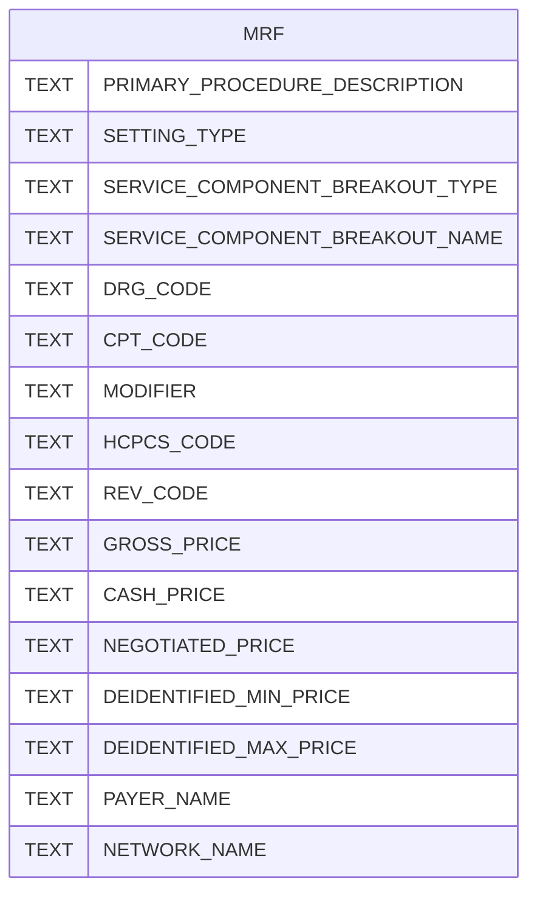
The `MRF` table stores detailed healthcare pricing data, including procedure descriptions, various price types (gross, cash, negotiated), and payer/network information. Sources: [LangChain-OpenAI/README.md:38-55]()

### Memory Management

To maintain context across turns in a conversation, the agent utilizes `ConversationBufferMemory`. This memory is passed to the agent via `agent_kwargs` with a `MessagesPlaceholder` for `variable_name="memory"`, allowing the LLM to access previous conversation history. Sources: [LangChain-OpenAI/hpt-chat.py:32-35](), [LangChain-OpenAI/lanarky_test.py:67-70]()

## Agent Initialization and Type

The agent is initialized using `initialize_agent` with the defined tools, the LLM, and the `AgentType.ZERO_SHOT_REACT_DESCRIPTION`. This agent type uses the ReAct framework, where the LLM reasons about what tool to use and how to use it, based solely on the tool's description and the current input. The `verbose=True` setting enables detailed logging of the agent's thought process. Sources: [LangChain-OpenAI/hpt-chat.py:36-42](), [LangChain-OpenAI/lanarky_test.py:71-77]()

The overall agent initialization flow is depicted below:

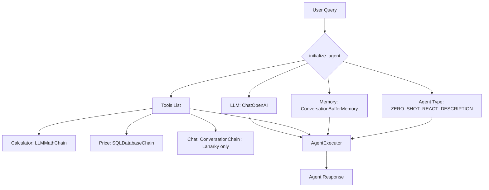
The `initialize_agent` function combines the LLM, available tools, memory, and agent type into an `AgentExecutor` which handles the reasoning and execution logic. Sources: [LangChain-OpenAI/hpt-chat.py:36-42](), [LangChain-OpenAI/lanarky_test.py:71-77]()

## Deployment and Interfaces

The LangChain Agent Workflow is demonstrated with two distinct interfaces: Chainlit for a chatbot UI and Lanarky for a web application using FastAPI and Gradio.

### Chainlit Interface (`hpt-chat.py`)

The `hpt-chat.py` file uses Chainlit to provide a web-based conversational interface. The `@cl.langchain_factory(use_async=False)` decorator registers the `factory` function, which creates and returns the `AgentExecutor`, making it available to the Chainlit application. This setup allows users to interact with the LangChain agent through a user-friendly chat interface. Sources: [LangChain-OpenAI/hpt-chat.py:14-15](), [LangChain-OpenAI/hpt-chat.py:10-11]()

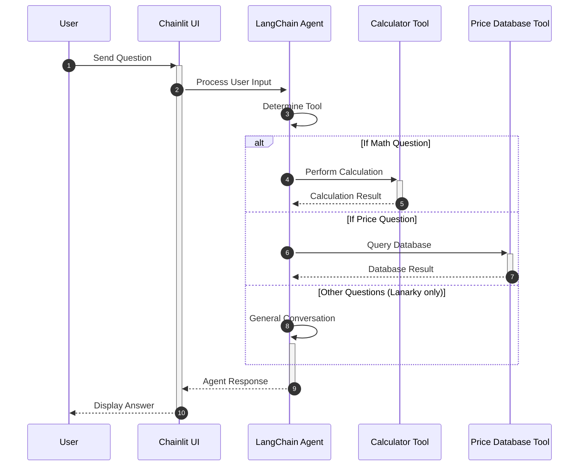
The sequence diagram illustrates how a user's question is routed through the Chainlit UI to the LangChain Agent, which then dispatches to the appropriate tool based on the query. Sources: [LangChain-OpenAI/hpt-chat.py]()

### Lanarky (FastAPI/Gradio) Interface (`lanarky_test.py`)

The `lanarky_test.py` file implements the agent workflow as a web service using FastAPI, enhanced by Lanarky for LangChain integration. It includes a Gradio interface for testing and exposes API routes for chat interaction. Sources: [LangChain-OpenAI/lanarky_test.py:27-36]()

The application mounts a Gradio app, serves an `index.html` template, and includes a `LangchainRouter` to handle different chat interaction modes:
*   `/chat`: Standard LangChain API route with streaming mode 1.
*   `/chat_json`: LangChain API route with streaming mode 2 (JSON).
*   `/ws`: WebSocket route for real-time, streaming chat.

Sources: [LangChain-OpenAI/lanarky_test.py:27-36]()

The WebSocket interface, defined in `templates/index.html`, facilitates real-time streaming of bot responses:

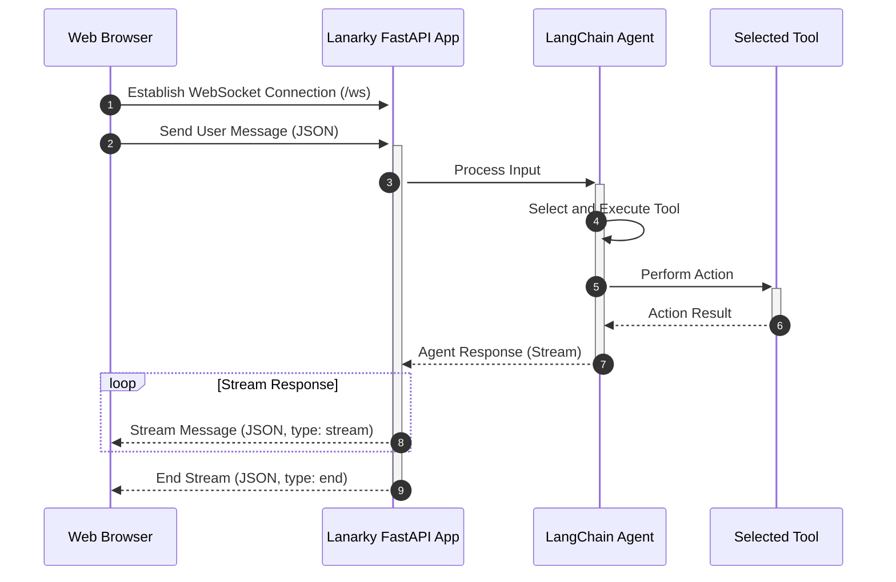
This sequence diagram details the WebSocket communication flow, from client message to streamed bot responses, including status updates like "Computing answer..." and "Chatbot is typing...". Sources: [LangChain-OpenAI/templates/index.html:158-160](), [LangChain-OpenAI/templates/index.html:190-210]()

## Dependencies

The project relies on several key Python packages for its functionality, as specified in `requirements.txt`:

*   `langchain`: The core framework for building LLM-powered applications.
*   `openai`: For interacting with OpenAI's API, specifically `ChatOpenAI`.
*   `python-dotenv`: To load environment variables, such as `OPENAI_API_KEY`.
*   `chainlit`: For building conversational UIs.
*   `sqlalchemy`: (For `LangChain-LocalAI/requirements.txt`, but relevant to `SQLDatabase` used by agent) For SQL database interaction.

Sources: [LangChain-OpenAI/requirements.txt](), [LangChain-LocalAI/requirements.txt]()

## Conclusion

The LangChain Agent Workflow provides a robust and extensible framework for developing conversational AI applications. By leveraging LangChain's `AgentExecutor` with specialized tools, memory management, and `ChatOpenAI`, the system can intelligently process diverse user queries, ranging from complex database lookups to mathematical computations. The demonstrated deployment options via Chainlit and Lanarky highlight the flexibility in integrating this agent-based intelligence into various user interfaces.

---

<a id='page-chatbot-features'></a>

## Chatbot Core Functionality

### Related Pages

Related topics: [LangChain Agent Workflow](#page-agent-workflow), [](#page-data-mrf)

<details>
<summary>Relevant source files</summary>

The following files were used as context for generating this wiki page:

- [LangChain-OpenAI/hpt-chat.py](https://github.com/jazzwang/hpt-chat/blob/main/LangChain-OpenAI/hpt-chat.py)
- [LangChain-OpenAI/lanarky_test.py](https://github.com/jazzwang/hpt-chat/blob/main/LangChain-OpenAI/lanarky_test.py)
- [LangChain-OpenAI/chainlit.md](https://github.com/jazzwang/hpt-chat/blob/main/LangChain-OpenAI/chainlit.md)
- [LangChain-OpenAI/requirements.txt](https://github.com/jazzwang/hpt-chat/blob/main/LangChain-OpenAI/requirements.txt)
- [LangChain-OpenAI/index.html](https://github.com/jazzwang/hpt-chat/blob/main/LangChain-OpenAI/index.html)
- [LangChain-OpenAI/README.md](https://github.com/jazzwang/hpt-chat/blob/main/LangChain-OpenAI/README.md)
</details>

# Chatbot Core Functionality

The chatbot core functionality provides an intelligent conversational agent capable of processing natural language queries, performing calculations, and querying a structured database. It is designed to interact with users through a web-based interface, leveraging large language models (LLMs) orchestrated by the LangChain framework. The system primarily focuses on extracting information from a Machine Readable File (MRF) database, particularly for price-related inquiries, while also handling general conversation and mathematical computations.

The project offers two main deployment strategies for the chatbot: one integrated with Chainlit for a rich chat UI, and another with Lanarky/FastAPI providing a RESTful API and WebSocket interface, along with a basic HTML frontend. Both implementations share the underlying LangChain agent and its specialized tools to deliver responses.

## Architecture Overview

The chatbot's architecture is centered around a LangChain agent that intelligently dispatches user queries to specialized tools. This agent communicates with a user interface layer, which can be either a Chainlit application or a FastAPI application serving an HTML frontend and WebSocket endpoint. The LLM acts as the brain, interpreting user input and determining the appropriate tool to use, maintaining conversational memory throughout the interaction.

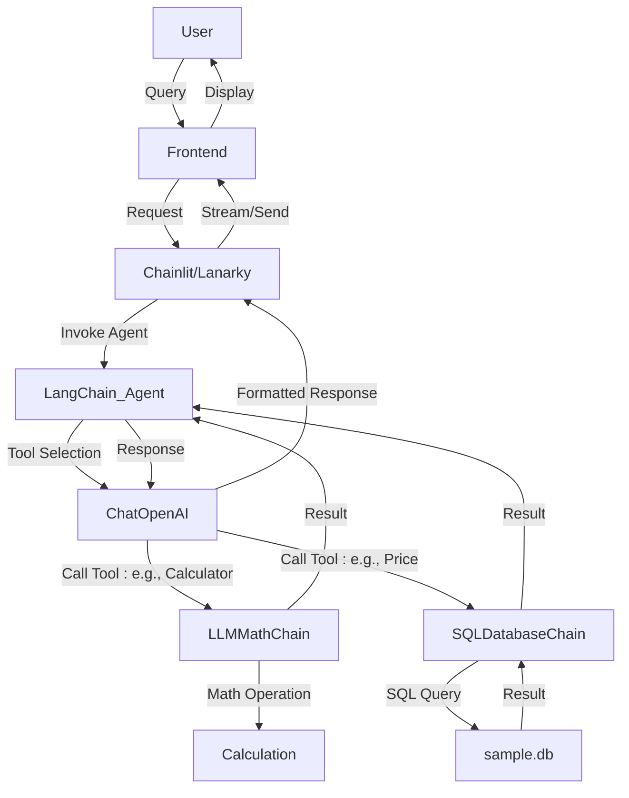
Sources: [hpt-chat.py:19-47](), [lanarky_test.py:50-68](), [index.html:84-110]()

## Core Components

The chatbot's intelligence and capabilities are built upon several key components from the LangChain ecosystem.

### LangChain Agent

The central processing unit for user queries is a `ZERO_SHOT_REACT_DESCRIPTION` agent. This agent type enables the LLM to reason about which tool to use and in what order, based on the tool's description and the current input. It dynamically selects the most appropriate tool to address the user's request.
Sources: [hpt-chat.py:44](), [lanarky_test.py:64]()

### Language Model (LLM)

The chatbot utilizes `ChatOpenAI` as its underlying language model. It is configured for streaming responses and a `temperature` of 0, indicating a preference for deterministic and factual answers over creative ones, which is suitable for information retrieval tasks.
```python
# LangChain-OpenAI/hpt-chat.py
llm = ChatOpenAI(
    temperature=0,
    streaming=True,
)
```
Sources: [hpt-chat.py:19-21](), [lanarky_test.py:51-53]()

### Specialized Tools

The LangChain agent is equipped with several tools, each designed to handle specific types of queries:

| Tool Name    | Description                                                               | Implementation Class   | Purpose                                                              |
| :----------- | :------------------------------------------------------------------------ | :----------------------- | :------------------------------------------------------------------- |
| `Calculator` | Useful for when you need to answer questions about math.                  | `LLMMathChain`           | Performs mathematical computations.                                  |
| `Price`      | Useful for when you need to answer questions about price.                 | `SQLDatabaseChain`       | Queries the `sample.db` database for price-related information.      |
| `Chat`       | Useful for when you need to answer questions not related to math or price | `ConversationChain`      | Handles general conversational queries (only in `lanarky_test.py`). |

Sources: [hpt-chat.py:24-32](), [lanarky_test.py:54-60]()

### Conversational Memory

To maintain context across turns in a conversation, the chatbot incorporates `ConversationBufferMemory`. This memory stores past interactions, allowing the agent to refer back to previous statements and provide more coherent and relevant responses. `MessagesPlaceholder` is used to integrate this memory into the agent's prompt.
```python
# LangChain-OpenAI/hpt-chat.py
agent_kwargs = {
    "extra_prompt_messages": [MessagesPlaceholder(variable_name="memory")],
}
memory = ConversationBufferMemory(memory_key="memory", return_messages=True)
```
Sources: [hpt-chat.py:38-40](), [lanarky_test.py:61-62]()

### Database Schema

The `SQLDatabaseChain` tool interacts with an SQLite database named `sample.db`. This database contains a single table, `MRF`, which stores healthcare service pricing information derived from a Machine Readable File. The schema of the `MRF` table is as follows:

| Column Name                     | Data Type | Description                                |
| :------------------------------ | :-------- | :----------------------------------------- |
| `PRIMARY_PROCEDURE_DESCRIPTION` | TEXT      | Description of the primary procedure.      |
| `SETTING_TYPE`                  | TEXT      | Type of setting for the service.           |
| `SERVICE_COMPONENT_BREAKOUT_TYPE` | TEXT      | Type of service component breakout.        |
| `SERVICE_COMPONENT_BREAKOUT_NAME` | TEXT      | Name of the service component breakout.    |
| `DRG_CODE`                      | TEXT      | Diagnosis Related Group code.              |
| `CPT_CODE`                      | TEXT      | Current Procedural Terminology code.       |
| `MODIFIER`                      | TEXT      | CPT modifier.                              |
| `HCPCS_CODE`                    | TEXT      | Healthcare Common Procedure Coding System. |
| `REV_CODE`                      | TEXT      | Revenue code.                              |
| `GROSS_PRICE`                   | TEXT      | Gross price of the service.                |
| `CASH_PRICE`                    | TEXT      | Cash price of the service.                 |
| `NEGOTIATED_PRICE`              | TEXT      | Negotiated price of the service.           |
| `DEIDENTIFIED_MIN_PRICE`        | TEXT      | Deidentified minimum price.                |
| `DEIDENTIFIED_MAX_PRICE`        | TEXT      | Deidentified maximum price.                |
| `PAYER_NAME`                    | TEXT      | Name of the payer (e.g., Aetna, BCBS).     |
| `NETWORK_NAME`                  | TEXT      | Name of the network (e.g., MCRX, Preferred). |

The database is populated from a CSV file (e.g., `ein_BaconCountyHospital_standardcharges.csv`) as part of the setup process.
Sources: [README.md:43-58]()

## User Interface and API Integration

The project provides two distinct methods for user interaction and API exposure.

### Chainlit Integration (`hpt-chat.py`)

For a direct, rich chat experience, the `hpt-chat.py` file integrates with Chainlit. The `@cl.langchain_factory` decorator wraps the agent creation, allowing Chainlit to automatically set up a web-based chat interface that streams responses from the LangChain agent. This offers a convenient way to deploy and interact with the chatbot with minimal UI development.
Sources: [hpt-chat.py:17](), [chainlit.md](), [chainlit_sample.py:15]()

### Lanarky/FastAPI Integration (`lanarky_test.py`)

The `lanarky_test.py` file demonstrates integration with Lanarky, which extends FastAPI to expose LangChain objects as API endpoints. This setup provides:
*   A FastAPI application (`app`).
*   An HTML frontend served via `Jinja2Templates` at the root `/` endpoint, displaying a "Chatbot Playground".
*   A `LangchainRouter` that creates several API endpoints for the LangChain agent:
    *   `/chat`: A standard API route for chat.
    *   `/chat_json`: An API route returning JSON responses.
    *   `/ws`: A WebSocket endpoint for streaming real-time chat interactions.

```python
# LangChain-OpenAI/lanarky_test.py
app = mount_gradio_app(FastAPI(title="ZeroShotAgentDemo"))
templates = Jinja2Templates(directory="templates")
chain = create_chain()

@app.get("/")
async def get(request: Request):
    return templates.TemplateResponse("index.html", {"request": request})

langchain_router = LangchainRouter(
    langchain_url="/chat", langchain_object=chain, streaming_mode=1
)
langchain_router.add_langchain_api_route(
    "/chat_json", langchain_object=chain, streaming_mode=2
)
langchain_router.add_langchain_api_websocket_route("/ws", langchain_object=chain)

app.include_router(langchain_router)
```
Sources: [lanarky_test.py:35-46]()

### Frontend User Interface (`index.html`)

The `index.html` file provides a basic web-based "Chatbot Playground" interface. It uses Tailwind CSS for styling and JavaScript to manage real-time communication with the backend via WebSockets.

The JavaScript client connects to `ws://localhost:8000/ws`. It sends user messages to the server and handles incoming messages, which are streamed word-by-word or as full responses. The UI updates dynamically based on message types (`start`, `stream`, `info`, `end`, `error`) received from the server, indicating states like "Computing answer...", "Chatbot is typing...", or displaying the final response.
Sources: [index.html:1-110]()

## Data Flow for Lanarky/FastAPI Chat

This sequence diagram illustrates the typical data flow when a user interacts with the chatbot via the Lanarky/FastAPI setup and the `index.html` frontend.

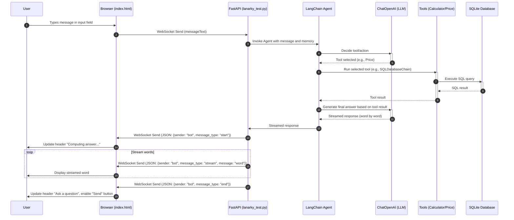
Sources: [index.html:84-110](), [lanarky_test.py:create_chain]()

## Setup and Requirements

To run the chatbot, specific dependencies and configurations are required.

### Environment Variables

An `OPENAI_API_KEY` is mandatory for the `ChatOpenAI` model to function. This key must be loaded from a `.env` file.
```bash
# Example from README.md
echo "OPENAI_API_KEY=sk-......." > .env
```
Sources: [README.md:9-11](), [hpt-chat.py:8](), [lanarky_test.py:17]()

### Python Dependencies

The core Python packages required for the chatbot's functionality are listed in `requirements.txt`.
```
# LangChain-OpenAI/requirements.txt
langchain
openai
python-dotenv
chainlit
```
For the Lanarky/FastAPI implementation, `sqlalchemy` is also implicitly required for `SQLDatabaseChain` (as seen in `LangChain-LocalAI/requirements.txt` and `README.md` examples).
Sources: [LangChain-OpenAI/requirements.txt](), [LangChain-LocalAI/requirements.txt](), [README.md:61-75]()

### Data Preparation

The chatbot relies on an SQLite database (`sample.db`) populated from a CSV file (e.g., `ein_BaconCountyHospital_standardcharges.csv.zip`). The `README.md` outlines a `make` command or a manual script (`./gen-sqlite-from-mrf.sh`) to download and process this data, creating the `MRF` table.
Sources: [README.md:19-58]()

## Conclusion

The chatbot's core functionality is robust, leveraging LangChain to orchestrate an LLM with specialized tools for mathematical calculations and database queries against a healthcare MRF. Its modular design supports deployment via both Chainlit for an interactive chat interface and Lanarky/FastAPI for a more traditional web application with WebSocket capabilities. This architecture ensures efficient processing of diverse user queries while maintaining conversational context and providing a responsive user experience.

---

<a id='page-data-mrf'></a>

##

<details>
<summary>Relevant source files</summary>

*   [LangChain-OpenAI/templates/index.html]()
*   [LangChain-OpenAI/README.md]()
*   [LangChain-OpenAI/chainlit.md]()
*   [LangChain-OpenAI/hpt-chat.py]()
*   [LangChain-OpenAI/lanarky_test.py]()
*   [LangChain-OpenAI/bacon.py]()
*   [LangChain-OpenAI/requirements.txt]()
</details>

# Chatbot Playground

The Chatbot Playground is an interactive application designed to demonstrate the capabilities of LangChain agents integrated with large language models (LLMs). It provides a web-based chat interface where users can ask questions, which are then processed by a LangChain agent capable of utilizing specialized tools for mathematical calculations and database queries. The project supports various deployment options, including a FastAPI/Lanarky server with WebSockets for real-time interaction and a Chainlit-based interface for rich conversational experiences. It is built to interact with a SQLite database, specifically targeting Machine Readable File (MRF) data from "Bacon Country Hospital". Sources: [LangChain-OpenAI/README.md](), [LangChain-OpenAI/chainlit.md](), [LangChain-OpenAI/hpt-chat.py](), [LangChain-OpenAI/lanarky_test.py]()

## User Interface (UI) Overview

The Chatbot Playground's web interface is rendered using `index.html`, styled with Tailwind CSS. It features a central chat body with a title "Chatbot Playground" and a dynamic header that displays status messages like "Ask a question", "Computing answer...", or "Chatbot is typing...". The main interaction area is a scrollable `div` with `id="messages"` where client (user) and server (chatbot) messages are displayed. User input is captured via an `input` field (`id="messageText"`) and sent using a "Send" button (`id="send"`). Sources: [LangChain-OpenAI/templates/index.html:115-165]()

### UI Components

| Component ID    | Description | Styling/Behavior |
|-----------------|-------------|------------------|
| Chatbox   | The interactive chat area where messages are displayed. | `div` with `id="messages"`, `overflow-auto`, `max-height: 500px` |

## Architectural Overview

The Chatbot Playground leverages LangChain to orchestrate interaction with an LLM and specialized tools.

### High-Level Architecture

The system consists of a user interface communicating with a backend server. The backend server utilizes LangChain to route user queries to appropriate tools (Calculator or Price/SQLDatabaseChain) or handle general conversation.

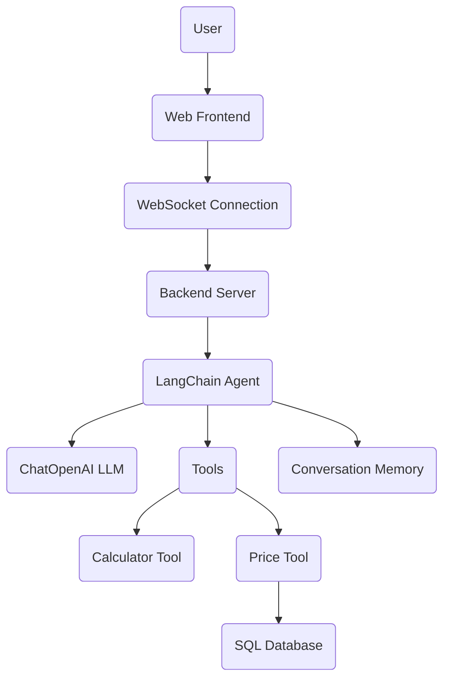
Sources: [LangChain-OpenAI/templates/index.html](), [LangChain-OpenAI/hpt-chat.py](), [LangChain-OpenAI/lanarky_test.py]()

### Frontend-Backend Communication

The frontend establishes a WebSocket connection to the backend for real-time, bidirectional communication.

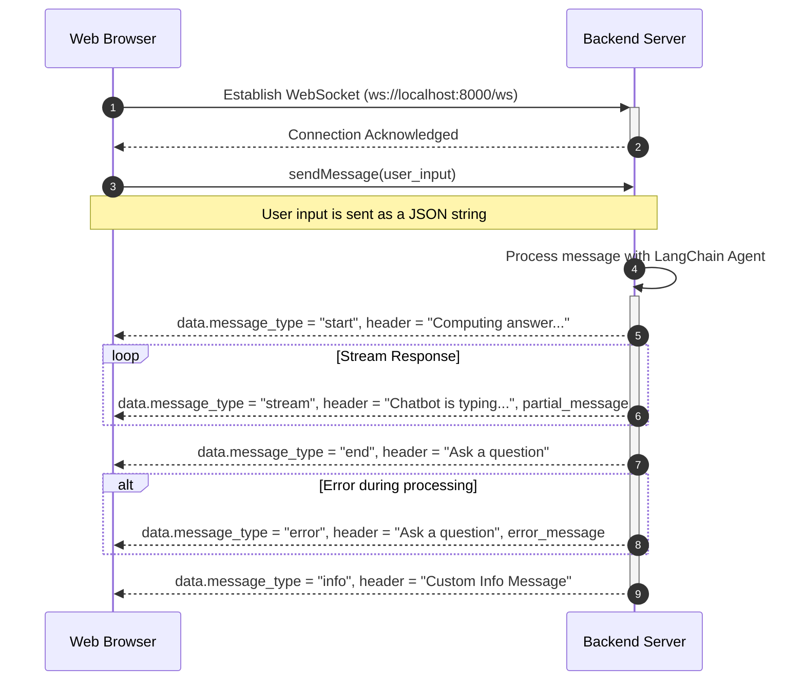
Sources: [LangChain-OpenAI/templates/index.html:105-144](), [LangChain-OpenAI/lanarky_test.py:53-54]()

The `ws.onmessage` handler in `index.html` processes incoming JSON messages from the server, updating the UI based on `data.message_type`:
*   `start`: Initializes a new server message block and sets the header to "Computing answer...".
*   `stream`: Appends received message parts to the last server message, updating the header to "Chatbot is typing...". Handles newlines by inserting `<br>`.
*   `info`: Updates the header with a custom informational message.
*   `end`: Resets the header to "Ask a question" and re-enables the send button.
*   `error`: Resets the header and send button, and appends the error message to the last displayed message.
*   Other messages (implicitly `data.sender === "client"`): Displays the user's message.
Sources: [LangChain-OpenAI/templates/index.html:108-144]()

The `sendMessage` function sends the user's input to the WebSocket server and updates the UI to show a "Loading..." button. Sources: [LangChain-OpenAI/templates/index.html:146-156]()

## Backend LangChain Agent

The core of the chatbot's intelligence is a LangChain `ZERO_SHOT_REACT_DESCRIPTION` agent. This agent dynamically decides which tool to use based on the user's query.

### Agent Initialization

The agent is initialized with:
*   An LLM (`ChatOpenAI`).
*   A set of `Tools`.
*   `AgentType.ZERO_SHOT_REACT_DESCRIPTION` for decision-making.
*   `ConversationBufferMemory` to maintain conversational context across turns.
Sources: [LangChain-OpenAI/hpt-chat.py:38-44](), [LangChain-OpenAI/lanarky_test.py:42-48]()

```python
# LangChain-OpenAI/hpt-chat.py
# Line 38-44
    return initialize_agent(
        tools,
        llm,
        agent=AgentType.ZERO_SHOT_REACT_DESCRIPTION,
        verbose=True,
        agent_kwargs=agent_kwargs,
        memory=memory
    )
```

### LLM Configuration

The agent utilizes `ChatOpenAI` as its language model, configured with:
*   `temperature=0`: For deterministic and consistent responses.
*   `streaming=True`: To enable real-time, token-by-token output, crucial for WebSocket streaming.
Sources: [LangChain-OpenAI/hpt-chat.py:16-19](), [LangChain-OpenAI/lanarky_test.py:28-31]()

### Tools

The LangChain agent is equipped with the following tools:

1.  **Calculator**
    *   **Name**: "Calculator"
    *   **Function**: `llm_math_chain.run`
    *   **Description**: "useful for when you need to answer questions about math"
    *   **Implementation**: Uses `LLMMathChain.from_llm(llm=llm, verbose=True)` to handle mathematical expressions.
    Sources: [LangChain-OpenAI/hpt-chat.py:22-26](), [LangChain-OpenAI/lanarky_test.py:32-36]()

2.  **Price**
    *   **Name**: "Price"
    *   **Function**: `db_chain.run`
    *   **Description**: "useful for when you need to answer questions about price"
    *   **Implementation**: Uses `SQLDatabaseChain.from_llm(llm=llm, db=db, verbose=True)` to query a SQLite database. The database connection is established via `SQLDatabase.from_uri("sqlite:///sample.db")`. This tool is specifically designed for queries related to medical pricing data.
    Sources: [LangChain-OpenAI/hpt-chat.py:27-31](), [LangChain-OpenAI/lanarky_test.py:37-41]()

### Conversation Memory

`ConversationBufferMemory` is used with `memory_key="memory"` and `return_messages=True` to store the conversation history. This memory is injected into the agent's prompt using `MessagesPlaceholder` to enable context-aware responses. Sources: [LangChain-OpenAI/hpt-chat.py:32-35](), [LangChain-OpenAI/lanarky_test.py:42-45]()

## Deployment and Execution

The Chatbot Playground offers multiple ways to run the application:

### FastAPI/Lanarky Deployment (`lanarky_test.py`)

The `lanarky_test.py` script sets up a FastAPI application (`app`) that exposes the LangChain agent via Lanarky.
*   A `LangchainRouter` is used to define API endpoints:
    *   `/chat`: Standard LangChain API route (streaming_mode=1).
    *   `/chat_json`: LangChain API route returning JSON (streaming_mode=2).
    *   `/ws`: WebSocket route for real-time interaction, used by `index.html`.
*   The `index.html` template is served at the root `/` endpoint.
*   Optionally, a Gradio app can be mounted for testing purposes.
Sources: [LangChain-OpenAI/lanarky_test.py:51-64]()

### Chainlit Deployment (`hpt-chat.py`)

The `hpt-chat.py` script integrates the LangChain agent with Chainlit. The `@cl.langchain_factory(use_async=False)` decorator registers the `factory` function, which initializes and returns the LangChain agent, allowing it to be run as a Chainlit application. Sources: [LangChain-OpenAI/hpt-chat.py:13-44]()

### Command-Line Interface (`bacon.py`)

The `bacon.py` script provides a direct command-line interface to the `SQLDatabaseChain`. It loads the SQLite database `sample.db` and uses `OpenAI` (not `ChatOpenAI`) to execute a single query provided as a command-line argument. This demonstrates a non-agentic, direct interaction with the SQL tool. Sources: [LangChain-OpenAI/bacon.py:9-15]()

```python
# LangChain-OpenAI/bacon.py
# Line 12-15
db = SQLDatabase.from_uri("sqlite:///sample.db")
llm = OpenAI(temperature=0)
db_chain = SQLDatabaseChain.from_llm(llm=llm, db=db, verbose=True)
db_chain.run(str(sys.argv[1]))
```

## Setup and Usage

To run the Chatbot Playground, an `OPENAI_API_KEY` is required. The project dependencies are managed via `requirements.txt`.

### Requirements

| Package           | Purpose                                    |
| :---------------- | :----------------------------------------- |
| `langchain`       | Core framework for LLM applications        |
| `openai`          | Python client for OpenAI API               |
| `python-dotenv`   | Loading environment variables from `.env`  |
| `chainlit`        | UI framework for LLM applications (optional) |
| `sqlalchemy`      | SQL toolkit and ORM for database interaction |

Sources: [LangChain-OpenAI/requirements.txt]()

### Installation and Execution

1.  **API Key**: Obtain an `OPENAI_API_KEY` and set it in a `.env` file. Sources: [LangChain-OpenAI/README.md:5-9]()
2.  **Install Dependencies**: `pip install -r requirements.txt`. Sources: [LangChain-OpenAI/README.md:13]()
3.  **Run**:
    *   Using `make`: The `make` command automates setup, including downloading a sample MRF CSV, unzipping it, and creating the `MRF` SQLite table.
    *   Manually: Execute `gen-sqlite-from-mrf.sh` (implied by `make` command context) and then run `bacon.py` with a question.
Sources: [LangChain-OpenAI/README.md:17-30]()

### Sample Questions

The chatbot supports a variety of queries, including:
*   **Simple Syntax**: "price range: X-RAY related procedure, payer: Aetna" Sources: [LangChain-OpenAI/chainlit.md:34-36]()
*   **Fuzzy Procedure Names**: "What is the average price of IRON related procedure?" Sources: [LangChain-OpenAI/chainlit.md:27-29]()
*   **Complex Questions**: Multi-part questions in bullet points, e.g., asking for negotiated prices of multiple procedures and their total amount. Sources: [LangChain-OpenAI/chainlit.md:41-47]()
*   **Database Inspection**: "list columns of database", "list name of databases". Sources: [LangChain-OpenAI/README.md:112-138]()
*   **Mathematical Queries**: E.g., `2 + 2` (handled by Calculator tool).
*   **Multi-language Support**: Questions in Spanish, Japanese, or Chinese are processed, leveraging the LLM's understanding. Sources: [LangChain-OpenAI/chainlit.md:9-24]()

Examples from the `README.md` show the agent successfully executing SQL queries and returning results:
*   `SQLQuery:SELECT COUNT(DISTINCT "CPT_CODE") FROM "MRF"`
*   `SQLQuery:SELECT COUNT(DISTINCT "PRIMARY_PROCEDURE_DESCRIPTION") FROM "MRF"`
*   `SQLQuery:SELECT "PRIMARY_PROCEDURE_DESCRIPTION", "GROSS_PRICE", "CASH_PRICE", "NEGOTIATED_PRICE" FROM "MRF" WHERE "PRIMARY_PROCEDURE_DESCRIPTION" LIKE '%IRON%' LIMIT 5;`

Sources: [LangChain-OpenAI/README.md:95-121]()

## Conclusion

The Chatbot Playground provides a robust example of a LangChain-powered conversational agent, demonstrating how to integrate LLMs with specialized tools for specific tasks like database querying and mathematical computations. Its flexible architecture supports both web-based interactive interfaces (FastAPI/Lanarky, Chainlit) and direct command-line interactions, making it a versatile proof-of-concept for building intelligent applications on structured data. Sources: [LangChain-OpenAI/hpt-chat.py](), [LangChain-OpenAI/lanarky_test.py](), [LangChain-OpenAI/bacon.py]()

---

